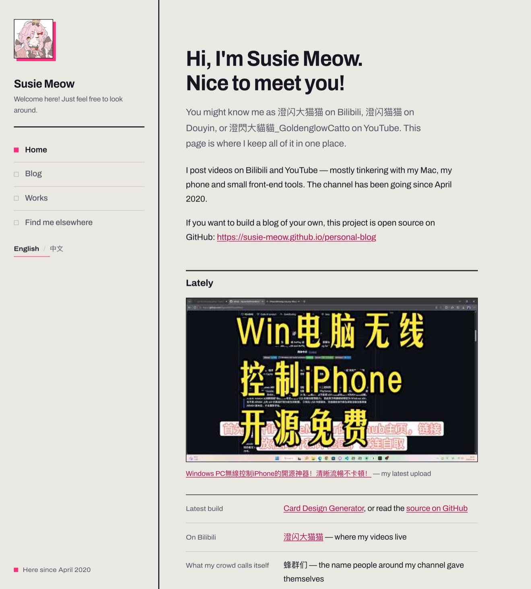

# Personal Site

一个**零依赖、零构建、零后端的纯静态个人主页**。左侧固定侧边栏，右侧四个可切换板块（主页 / 博客 / 作品 / 在别处找我），中英双语，桌面和移动端共用同一套版式。

内容全部放在 `data/` 里的 JSON 文件中 —— **改文字、换链接、加卡片都不用碰代码**：在 GitHub 网页上改几个字、点一下提交，一两分钟后线上就变了。

> 这既是 **Susie Meow** 的线上主页，也是一个可以直接拿去改成自己站点的模板。

[](https://susie-meow.github.io/personal-blog)

**在线预览 → <https://susie-meow.github.io/personal-blog>**

| 特点 | 说明 |
|---|---|
| **纯静态，没有后端** | 只有 HTML / CSS / 原生 JavaScript。没有数据库、没有服务端，页面自己不会去请求任何第三方接口 |
| **零依赖、零构建** | 仓库里没有 `package.json`，也没有 `node_modules`；不需要 npm，不需要打包。文件丢到任何静态服务器上就能跑 |
| **内容与代码分离** | 唯一的事实来源是 `data/*.json`，`index.html` 只负责骨架和排版 |
| **中英双语** | 右上角一键切换，选择记在浏览器里，刷新后保持不变 |
| **单页多板块** | 侧边栏点击切换，地址栏会变成 `#blog`、`#works`，可以直接分享某一板块；文章是 `#post/<文件名>` |
| **站内文章** | 博客正文放在 `data/posts/`，**一篇文章一个 JSON 文件**，在 `data/blog.json` 里填一个 `post` 字段就链过去。同样不用碰代码 |
| **最新视频自动同步** | GitHub Actions 每 6 小时抓一次 YouTube，把结果写回仓库（见 [第 9 节](#9-最新视频是怎么自动更新的)） |
| **自适应排版** | 桌面和移动端共享同一套版式，不靠断点硬跳 |

**技术栈**：原生 HTML + CSS + JavaScript（ES5 写法，没有框架、没有编译器）＋ Python 3 标准库（只用在那个同步脚本上）＋ GitHub Actions ＋ GitHub Pages。整个仓库**没有一行需要构建的代码**。

**许可**：[MIT](LICENSE) —— 自由使用、自由修改、商用也行，保留版权声明即可。个人内容那部分的说明见 [第 13 节](#13-许可与来源)。

**默认状态下唯一的外部资源**是 Google Fonts（Archivo + Noto Sans SC）。断网时字体会退化成系统字体，其余功能不受影响。

> 唯一的例外：如果你在 `data/home.json` 里填了 B 站 BV 号，首页那个播放器会额外从 B 站加载（见[例 9](#例-9让首页方框里直接播-b-站视频)）。不填就只是本地文件加一份字体。

---

## 从哪开始

| 你是…… | 直接去 |
|---|---|
| 只是路过，想看看长什么样 | 上面的截图，或 [在线预览](https://susie-meow.github.io/personal-blog) |
| 想照这个给自己做一个 | [第 10 节 · fork 之后怎么改成自己的](#10-fork-之后怎么改成自己的) |
| 站点已经跑起来了，想改名字 / 头像 / 链接 | [第 4 节 · 最快上手](#4-最快上手) |
| 想在自己电脑上跑一份看看 | [第 2 节 · 在自己电脑上预览](#2-在自己电脑上预览) |
| 还没部署，或者想换域名 | [第 3 节 · 部署到 GitHub Pages](#3-部署到-github-pages) |
| 想搞懂「最新视频」为什么能自动更新 | [第 9 节](#9-最新视频是怎么自动更新的) |
| 想知道某个字段是什么意思 | [第 6 节 · 数据文件字段详解](#6-数据文件字段详解) |
| 改完以后出问题了 | [第 11 节 · 出错了怎么办](#11-出错了怎么办) |

---

## 目录

**第一部分 · 跑起来**

1. [目录结构与文件总览](#1-目录结构与文件总览)
2. [在自己电脑上预览](#2-在自己电脑上预览)
3. [部署到 GitHub Pages](#3-部署到-github-pages)

**第二部分 · 改内容（不用写代码）**

4. [最快上手](#4-最快上手)
5. [写 JSON 前必读的 6 条规则](#5-写-json-前必读的-6-条规则)
6. [数据文件字段详解](#6-数据文件字段详解)
7. [常见操作示例](#7-常见操作示例)
8. [提交到 GitHub 并让它生效](#8-提交到-github-并让它生效)

**第三部分 · 自动化、复用与排错**

9. [最新视频是怎么自动更新的](#9-最新视频是怎么自动更新的)
10. [fork 之后怎么改成自己的](#10-fork-之后怎么改成自己的)
11. [出错了怎么办](#11-出错了怎么办)
12. [注意事项清单](#12-注意事项清单)
13. [许可与来源](#13-许可与来源)

---

## 1. 目录结构与文件总览

```
你的仓库/
├── index.html               ← 网页骨架 + 全部样式（⚠️ 不要改）
├── README.md                ← 这份说明
├── LICENSE                  ← MIT 开源许可证
│
├── data/                    ← ★ 网站内容，你只改这里
│   ├── site.json                站点设置：语言、导航菜单、标签页标题
│   ├── profile.json             侧边栏：头像、名字、一句话简介
│   ├── home.json                主页：大标题、导语、正文、最新视频、Lately 表格
│   ├── blog.json                博客板块的条目列表（只放标题和摘要）
│   ├── posts/                   博客正文：★ 一篇文章一个文件
│   │   └── how-this-site-was-built.json
│   ├── works.json               作品板块的卡片列表
│   ├── elsewhere.json           「在别处找我」的链接列表
│   ├── sources.json             自动同步的频道设置
│   └── live.json                ⚙️ 机器人写的，别改
│
├── assets/                  ← 图片
│   ├── avatar-youtube.jpg        头像（侧边栏和标签页图标都用这张）
│   ├── auto-latest.jpg           ⚙️ 机器人下载的最新视频封面
│   └── preview.jpg               本 README 顶部那张截图（和网站无关，可删）
│
├── .github/workflows/
│   └── sync-latest.yml           ⚙️ 定时任务：每 6 小时同步一次最新视频
└── tools/
    └── sync_latest.py            ⚙️ 定时任务调用的脚本（纯标准库）
```

**工作原理一句话**：访客打开 `index.html`，它用 `fetch` 把 `data/` 里的 JSON 读进来，填进已经写好的骨架里。所以 **改数据 = 改网站**，不需要编译，也不需要重新部署。

> `.json` 是一种「一个字段对一个值」的纯文本格式，人和机器都能读。你完全可以把它当成一张填好的表格。

### 哪个文件能改、改完看哪一节

| 位置 | 管什么 | 能改吗 |
|---|---|---|
| `data/site.json` | 默认语言、导航菜单（数量 / 顺序 / 名字）、标签页标题 | ✅ 可改 |
| `data/profile.json` | 侧边栏头像、名字、一句话简介、底部状态行 | ✅ 可改 |
| `data/home.json` | 主页大标题、导语、正文段落、最新视频、Lately 表格、页脚 | ✅ 可改 |
| `data/blog.json` | 博客板块的标题、导语、条目列表（**只是目录**） | ✅ 可改 |
| `data/posts/` | 博客**正文**，一篇文章一个 `.json` 文件 | ✅ 可加可改（见 [第 6 节](#6-数据文件字段详解)） |
| `data/works.json` | 作品板块的卡片列表 | ✅ 可改 |
| `data/elsewhere.json` | 「在别处找我」的链接列表 | ✅ 可改 |
| `data/sources.json` | 自动同步抓哪个频道 | ✅ 换频道时才改（见 [第 9 节](#9-最新视频是怎么自动更新的)） |
| `data/live.json` | 最新视频的标题 / 链接 / 日期 | ⚙️ **自动生成，改了会被覆盖** |
| `assets/` | 图片文件 | ✅ 可加；删之前先确认没被引用 |
| `assets/auto-latest.jpg` | 最新视频的封面 | ⚙️ **自动生成，别删** |
| `assets/preview.jpg` | 本 README 顶部的截图 | ✅ 可删；想换成自己的截图就直接覆盖它 |
| `.github/workflows/sync-latest.yml` | 那个定时任务 | ⚙️ 不用动 |
| `tools/sync_latest.py` | 定时任务调用的脚本 | ⚙️ 不用动 |
| `index.html` | 页面骨架与全部样式 | ❌ **不要改** |
| `README.md` | 这份说明 | ✅ 随意 |
| `LICENSE` | 开源许可证（MIT） | ⚠️ 不要删，版权声明要留着 |

`data/` 必须和 `index.html` **放在同一层**。只要它们同级，整个网站在仓库里放哪个文件夹都可以（相对路径，子目录部署也正常）。

---

## 2. 在自己电脑上预览

### 先把代码拿到本地

- **只是想改内容**（网站已经部署好了）：不用下载任何东西，直接看 [第 4 节](#4-最快上手)，在 GitHub 网页上改就行。
- **想在自己电脑上跑一份完整的**：
  - 不熟命令行：打开仓库页 → 绿色 **Code** 按钮 → **Download ZIP** → 解压。
  - 会用命令行：`git clone https://github.com/你的用户名/你的仓库名.git`

整个项目**没有需要安装的依赖** —— 不需要 `npm install`，不需要打包。下载下来就是完整可跑的。

### 起一个本地服务器

**⚠️ 直接双击 `index.html` 用浏览器打开是看不到内容的**，只会显示「Data could not be loaded / 数据没能读进来」。

这不是网站坏了，是浏览器的安全限制：`file://` 协议下页面不允许读取本地 JSON 文件。**部署到 GitHub Pages 后一切正常。**

想在提交前先看看效果，在项目文件夹里起一个临时本地服务器（macOS / Linux 自带 Python）：

```bash
cd 到本文件夹的路径     # 把文件夹直接拖进终端窗口就能自动填路径
python3 -m http.server 8000
```

然后浏览器打开 <http://localhost:8000> 就能看到完整效果。按 `Ctrl+C` 结束。

> - Windows 上如果 `python3` 没反应，试试 `python -m http.server 8000`。
> - 改完 JSON **只需要刷新浏览器**，服务器不用重启。
> - 端口被占用就换一个（`8001`、`8002`…）。

这一步只影响你自己电脑上的预览。要真正让访客看到，看下一节。

---

## 3. 部署到 GitHub Pages

### 前提

`index.html` 必须和 `data/`、`assets/` **在同一层**。只要它们同级，整个网站在仓库里放哪个文件夹都可以。

> 如果你是把外层文件夹（比如 `personal-site/`）整个传上来的，那 `index.html` 就在子目录里，必须按下面「情况 B」设置。

### 情况 A：`index.html` 在仓库根目录

1. 仓库顶部点 **Settings**。
2. 左侧点 **Pages**。
3. **Build and deployment** → **Source** 选 **Deploy from a branch**。
4. **Branch** 选 `main`，文件夹选 **`/ (root)`**。
5. 点 **Save**，页面上会出现你的网址（形如 `https://用户名.github.io/仓库名/`）。

### 情况 B：`index.html` 在子文件夹里

二选一：

- 把 `index.html`、`data/`、`assets/` 一起移到仓库根目录；或
- 把整个网站放进一个叫 `docs/` 的文件夹，Source 仍选 **Deploy from a branch**，但 Branch 下面的文件夹改成 **`/docs`**。

### 几个容易踩的坑

| 坑 | 说明 |
|---|---|
| Source 选了 **GitHub Actions** | ⚠️ 不要选。本仓库没有部署用的工作流，选了会一直发布不出来。选 **Deploy from a branch** |
| 改完看不到变化 | 部署本身要等 1～2 分钟。先去 **Actions** 看是否变绿，再强制刷新页面 |
| 想用自己的域名 | 在 **Settings → Pages → Custom domain** 里填。改完之后 `index.html` 里不需要改任何路径（全站都是相对路径） |
| 图片 404 | 检查 `assets/` 里的文件名大小写和 JSON 里的路径是否**完全一致** |

> 部署和「最新视频自动同步」是两件互不干扰的事。即使定时任务从没跑过，网站本身也照样能正常打开，只是方框里没有视频而已。

---

## 4. 最快上手

改内容只有三步：

1. 打开 GitHub 上你的仓库，进入 `data` 文件夹。
2. 点开想改的文件（比如 `profile.json` 改名字和简介），点右上角的 **✏️ 铅笔图标**。
3. 改好之后往下拉，写一句说明（比如 `更新简介`），点 **Commit changes**。

等 **1～2 分钟**，打开网站，按 `Ctrl+Shift+R`（Mac 是 `Cmd+Shift+R`）强制刷新，就能看到新内容。

> 💡 改错不要紧 —— 每个文件的历史版本 GitHub 都留着，在提交记录里能找到旧内容贴回来。所以**一次只改一处**，改完确认线上正常，再动下一处。

想先在本机看效果、不想每次都等部署，看 [第 2 节](#2-在自己电脑上预览)。

---

## 5. 写 JSON 前必读的 6 条规则

改 JSON 出错，99% 是前两条。

### 规则 1：必须用英文双引号，而且成对出现

```
✅ "name": "Susie Meow"
❌ "name": 'Susie Meow'          ← 单引号不行
❌ "name": “Susie Meow”          ← 中文引号不行
❌ "name": Susie Meow            ← 没有引号不行
```

### 规则 2：每项之间要有逗号，最后一项不能有逗号

```json
{
  "name": "Susie Meow",
  "status": "Here since April 2020"
}
```

注意 `"status"` 那一行末尾**没有逗号**。多一个逗号 = 整页报错。

### 规则 3：JSON 里不能写注释

想给未来的自己留句说明，就用 `"_comment"` 这个特殊字段，它对网站没有任何影响：

```json
"_comment": "这里改名字，中英文各写一次"
```

### 规则 4：所有文本都要写两份（英文 + 中文）

因为右上角可以切换语言，所以大多数字段长这样：

```json
"status": {
  "en": "Here since April 2020",
  "zh": "自 2020 年 4 月在这里"
}
```

`en` = English，`zh` = 中文。**两个都要写**，否则切到那种语言时这块会空着。
只有少数几处例外（比如 `profile.json` 的 `name`、列表里的 `meta`），它们不分语言，直接写字符串就行 —— 字段表里会注明。

### 规则 5：想在文字中间插入链接，用「小块」写法

普通文字直接写字符串就够了。但要在一句话里让某几个字可以点击，就要写成**数组**（方括号 `[ ]`），每块是一个 `{ }`：

```json
"value": {
  "en": [
    { "text": "澄闪大猫猫", "url": "https://space.bilibili.com/458056589" },
    { "text": " — where my videos live" }
  ]
}
```

渲染出来是：`澄闪大猫猫 — where my videos live`（前半段是链接）。

一句话里的每一块，可以带三种「特殊效果」（都不带就是普通文字）：

| 一块长这样 | 效果 |
|---|---|
| `{ "text": "B 站", "url": "https://…" }` | 变成可以点的链接 |
| `{ "text": "package.json", "code": true }` | 变成行内代码（浅色底，用来标出文件名、命令、变量名） |
| `{ "text": "改内容很方便。", "strong": true }` | 变成**加粗**（强调句子里的一小段） |

三种可以混在同一个数组里用。想加一个「普通文字」块，写 `{ "text": "…" }` 就行。

### 规则 6：图片路径以 `assets/` 开头，严格区分大小写

```json
"src": "assets/avatar-main.jpg"        ← 仓库里的图片（推荐）
"src": "https://example.com/pic.jpg"   ← 外链图片（不推荐，可能失效）
```

**不要把外部图床的地址直接写进来** —— 尤其是 `i.ytimg.com` 这类国内打不开的域名，页面会出现破图。正确做法是把图片下载到 `assets/` 再引用，步骤见[例 2](#例-2换头像)。

---

## 6. 数据文件字段详解

> 字段说明里的 ✅ = 必填，⭕ = 可选。**可选字段留空或整行删掉都可以，页面会自动跳过它**，不影响其他内容。

### `data/site.json` —— 站点设置

| 字段 | 必填 | 说明 |
|---|---|---|
| `defaultLanguage` | ✅ | 访客第一次进来显示哪种语言，填 `en` 或 `zh` |
| `languages` | ✅ | 支持的语言列表。`code` 是代号（`en` / `zh`），`label` 是按钮上显示的文字 |
| `languageGroupLabel` | ⭕ | 语言开关的无障碍标签，一般不用改 |
| `skipLink` | ⭕ | 键盘 Tab 键跳转用的提示文字 |
| `metaDescription` | ⭕ | 给搜索引擎看的简介（不会显示在页面上） |
| `nav` | ✅ | ★ 导航列表，条数不限，顺序就是菜单顺序 |

`nav` 里每条的字段：

| 字段 | 必填 | 说明 |
|---|---|---|
| `id` | ✅ | 板块代号，只能用小写英文字母和数字，例如 `home`、`blog`。**点菜单时网址会变成 `#blog`** |
| `layout` | ✅ | 用哪种排版。现成三种：`home`（带大标题和表格的主页）、`list`（一行一行的列表）、`cards`（一格一格的卡片） |
| `dataFile` | ✅ | 这个板块读哪个数据文件，例如 `blog.json` |
| `label` | ✅ | 菜单上显示的文字（双语） |
| `title` | ✅ | 切到这个板块时浏览器标签页显示的标题（双语） |

### `data/profile.json` —— 侧边栏个人信息

| 字段 | 必填 | 说明 |
|---|---|---|
| `favicon` | ⭕ | 浏览器标签上的小图标，一般和头像用同一张 |
| `avatar.src` | ✅ | 头像图片路径 |
| `avatar.alt` | ⭕ | 图片无法显示时的替代文字（双语） |
| `name` | ✅ | 侧边栏名字。**这个是纯字符串，不分语言**，例如 `"Susie Meow"` |
| `role` | ✅ | 名字下面的一句话简介（双语） |
| `status` | ⭕ | 侧边栏最底部那一行小字（双语） |

### `data/home.json` —— 主页

| 字段 | 必填 | 说明 |
|---|---|---|
| `heading` | ✅ | 页面最大的那个标题（双语） |
| `lede` | ⭕ | 标题下面的导语（双语） |
| `paragraphs` | ⭕ | 正文段落数组，每组是一段；想加第三段就再复制一组 |
| `video.enabled` | ⭕ | `true` 显示最新视频，`false` 整块隐藏 |
| `video.bvid` | ⭕ | 填一个 BV 号，方框里就直接播**B 站**这条视频。留空则显示自动同步到的最新一条。见[例 9](#例-9让首页方框里直接播-b-站视频) |
| `video.alt` | ⭕ | 封面图的替代文字（双语），给读屏软件用 |
| `video.autoLabel` | ⭕ | 图注前缀（双语），例如 `"Latest on YouTube: "` |
| `video.watchLabel` | ⭕ | 图注里那个链接的文字（双语），例如 `"Watch on Bilibili"` |
| `video.suffix` | ⭕ | 图注后面的小字（双语），例如 `" — my latest upload"` |
| `video.image` / `video.url` / `video.linkText` | ⭕ | **兜底用，留空即可**。只在自动同步完全没有数据时才用它们（就是手写封面 + 手写标题的老办法） |
| `lately.title` | ⭕ | 「Lately」表格上方的小标题（双语） |
| `lately.items` | ⭕ | 表格行数组。每行 `label`（左列名）+ `value`（右侧内容，可用规则 5 的链接写法） |
| `footnote` | ⭕ | 页面最底部的小字说明（双语） |

**主页从上到下的顺序**是：大标题 → 导语 → 正文段落 → 「Lately」小节（小节标题下先是视频框，再是表格）→ 页脚说明。

**「最新视频」到底显示哪一条？** 按这三步依次判断，前一步有就不看后一步：

1. `video.bvid` 填了 → 显示 B 站播放器（你贴的那条视频）
2. 没填，但自动同步拿到了数据 → 显示自动同步的最新一条（封面 + 标题 + 链接，全是机器人写的）
3. 都没有 → 才用 `video.image` / `video.url` / `video.linkText` 这三个手写字段

所以：**什么都不填 = 全自动**。只有当你想让访客在首页就能直接看 B 站那条时，才需要填一个 BV 号。

### `data/blog.json` 与 `data/elsewhere.json` —— 列表类板块

这两个文件结构完全一样：

| 字段 | 必填 | 说明 |
|---|---|---|
| `heading` | ✅ | 板块大标题（双语） |
| `lede` | ⭕ | 导语（双语） |
| `items` | ✅ | ★ 条目数组，**每加一组 `{ }` 就多一行** |
| `footnote` | ⭕ | 底部小字（双语，支持链接写法） |

`items` 里每条：

| 字段 | 必填 | 说明 |
|---|---|---|
| `title` | ✅ | 标题（双语） |
| `note` | ⭕ | 标题下面的说明文字（双语） |
| `meta` | ⭕ | 最右边那列小字：博客里通常写日期（`"2026-09-30"`），「在别处找我」里通常写账号（`"UID 458056589"`）。**可以写双语，也可以直接写字符串**（两种语言一样时用后者更省事） |
| `url` | ⭕ | 点击这一行跳到**站外**网址。留空字符串 `""` 或删掉这行，这一行就不可点击 |
| `post` | ⭕ | 填一个**站内文章**的 slug（`data/posts/` 里那个文件的文件名，去掉 `.json`）。填了就点进站内的文章页，**并且优先于 `url`**。只对 `data/blog.json` 有意义 |

### `data/posts/` —— 博客正文

`data/blog.json` 只是**目录**（标题 + 一句话摘要 + 日期）。正文放在 `data/posts/` 里，**一篇文章一个文件**，文件名直接变成它的网址：

```
data/posts/how-this-site-was-built.json   →   网址  #post/how-this-site-was-built
```

文件名只用小写英文字母、数字和短横线，结尾的 `.json` 一定要有。

顶层字段：

| 字段 | 必填 | 说明 |
|---|---|---|
| `title` | ✅ | 文章大标题（双语） |
| `date` | ⭕ | 显示在标题下面的日期，如 `"2026-09-30"`（只有一份，不分语言） |
| `lede` | ⭕ | 标题下面那段导语（双语） |
| `body` | ✅ | ★ 正文：一个数组，**数组里每一块只写一个键** |
| `footnote` | ⭕ | 正文末尾的小字（双语） |
| `_comment` | ⭕ | 写给自己看的备注，网站不显示 |

`body` 里每一块，**键名决定它渲染成什么**：

| 键名 | 渲染成 | 值怎么写 |
|---|---|---|
| `p` | 段落 | 文字，或 `[ ]` 小块（想在句子里插链接 / 行内代码 / 加粗时用，写法见[规则 5](#规则-5想在文字中间插入链接用小块写法)） |
| `h2` | 二级小标题 | 文字 |
| `h3` | 三级小标题 | 文字 |
| `ul` | 无序列表（•） | **数组**，每一项是一段文字 |
| `ol` | 有序列表（1. 2. 3.） | 和 `ul` 一样，只是带编号 |
| `quote` | 引用块（左边一条竖线） | 文字 |
| `code` | 代码块（灰底、可横向滚动） | 字符串。两种语言一样时直接写，`\n` 表示换行 |
| `img` | 配图（图 + 可选图注） | `{ "src": …, "alt": …, "caption": … }` |

> **一句话记住：一块只写一个键。** 写 `{ "p": "…" }`，不要写 `{ "type": "p", "text": "…" }`。块的先后顺序就是正文的先后顺序。

一个能直接用的最小例子（新建 `data/posts/my-first-post.json`）：

```json
{
  "title": { "en": "My first post", "zh": "我的第一篇文章" },
  "date": "2026-10-01",
  "lede": { "en": "A short intro.", "zh": "一句话导语。" },
  "body": [
    { "p": { "en": "First paragraph.", "zh": "第一段。" } },
    { "h2": { "en": "A heading", "zh": "一个小标题" } },
    { "ul": [
      { "en": "First point.", "zh": "第一点。" },
      { "en": "Second point.", "zh": "第二点。" }
    ] },
    { "quote": { "en": "Something worth quoting.", "zh": "一句值得引用的话。" } },
    { "p": [
      { "text": "A sentence with " },
      { "text": "some code", "code": true },
      { "text": " and a " },
      { "text": "link", "url": "https://example.com" },
      { "text": " inside it." }
    ] }
  ],
  "footnote": { "en": "Thanks for reading.", "zh": "感谢阅读。" }
}
```

配图块长这样（图片文件仍然放在 `assets/` 里）：

```json
    { "img": {
        "src": "assets/my-photo.jpg",
        "alt": { "en": "What is in the picture", "zh": "图里是什么" },
        "caption": { "en": "Shown under the picture.", "zh": "显示在图下面。" }
    } }
```

> `src` 的写法同[规则 6](#规则-6图片路径以-assets-开头严格区分大小写)：以 `assets/` 开头，严格区分大小写。
> **想删掉一篇文章**：删掉 `data/posts/` 里那个文件，再删掉 `data/blog.json` 里对应的那一组 `{ }`（删法见[例 6](#例-6删除一条内容)）。

### `data/works.json` —— 作品卡片板块

| 字段 | 必填 | 说明 |
|---|---|---|
| `heading` / `lede` / `footnote` | — | 同列表类板块 |
| `items` | ✅ | ★ 卡片数组，每加一组 `{ }` 就多一张卡片 |

`items` 里每条：

| 字段 | 必填 | 说明 |
|---|---|---|
| `year` | ⭕ | 卡片顶部的年份标签。可以写 `"2026"`，也可以写双语（如未发布写 `{"en":"soon","zh":"敬请期待"}`）。**留 `""` 则这张卡不显示年份** |
| `title` | ✅ | 卡片标题（双语） |
| `note` | ✅ | 卡片正文（双语） |
| `url` | ⭕ | 填了网址，标题就变链接；留空则标题是普通文字 |

> `data/sources.json` 和 `data/live.json` 属于自动同步部分，见 [第 9 节](#9-最新视频是怎么自动更新的)。

---

## 7. 常见操作示例

> 以下步骤都在 GitHub 网页端完成：打开仓库 → 进 `data` 文件夹 → 点文件 → 右上角 ✏️ 铅笔。
> **每改完一个例子就提交一次**，不要一次改好几个文件。

### 例 1：改名字、改简介、改底部小字

打开 `data/profile.json`：

```json
  "name": "Susie Meow",
  "role": {
    "en": "这里改成英文简介",
    "zh": "这里改成中文简介"
  },
  "status": {
    "en": "Here since April 2020",
    "zh": "自 2020 年 4 月在这里"
  }
```

改完提交即可。`name` 只有一份（不分语言），`role` 和 `status` 中英各写一次。

### 例 2：换头像

**第一步，把图片传进仓库**

1. 在 GitHub 仓库里进入 `assets` 文件夹。
2. 点右上角 **Add file → Upload files**，把电脑里的图片拖进去。
3. 命名建议：**只用小写英文字母、数字和短横线**，例如 `avatar-main.jpg`。
   ❌ 不要用空格、中文文件名、`头像 最终版2.jpg` 这种。
4. 等上传完，点 **Commit changes**。

**第二步，让网站用这张新图**

打开 `data/profile.json`，改这两处：

```json
  "favicon": "assets/avatar-main.jpg",
  "avatar": {
    "src": "assets/avatar-main.jpg",
    "alt": { "en": "My avatar", "zh": "我的头像" }
  }
```

> 头像在方形框里显示，用正方形图片最合适。旧图片确认没人引用了可以删（在 `assets` 里点它 → 右上角垃圾桶）；不确定就先留着，不影响网站。

### 例 3：在「在别处找我」里新增一个平台

打开 `data/elsewhere.json`，找到 `"items": [` 后面的列表。
**先在最后一个条目的 `}` 后面补一个逗号**，然后把下面这段粘进去（注意新粘进去的这组末尾不带逗号）：

```json
      {
        "title": { "en": "微博 Weibo", "zh": "微博 Weibo" },
        "note": {
          "en": "Short clips and photos between uploads.",
          "zh": "两次更新之间会在这儿发点和照片。"
        },
        "meta": "@yourhandle",
        "url": "https://weibo.com/yourhandle"
      }
```

改完的片段看起来应该像这样（注意逗号位置）：

```json
    {
      "title": { "en": "Email", "zh": "邮箱" },
      "note": { "en": "…", "zh": "…" },
      "meta": "you@example.com",
      "url": ""
    },
    {
      "title": { "en": "微博 Weibo", "zh": "微博 Weibo" },
      "note": {
        "en": "Short clips and photos between uploads.",
        "zh": "两次更新之间会在这儿发点和照片。"
      },
      "meta": "@yourhandle",
      "url": "https://weibo.com/yourhandle"
    }
  ],
```

拉到底 → 填 Commit message（例如 `add Weibo link`）→ **Commit changes**。

### 例 4：新增一篇博客文章

分两种情况：**正文写在自己站里**的走 A，**文章在别的平台、只放个链接过去**的走 B。

#### A. 正文写在自己的站点里

**第一步，建正文文件。** 在 `data/posts/` 里新建一个文件，文件名就是它在网址里的那一串（只用小写字母、数字、短横线，结尾 `.json` 不能少）：

```
data/posts/my-first-post.json   →   网址  #post/my-first-post
```

把[第 6 节里的最小例子](#6-数据文件字段详解)整段粘贴进去，改成自己的文字即可。

**第二步，在目录里加一行。** 打开 `data/blog.json`，在 `items` 列表里加一组（记得先给上一组补逗号）：

```json
    {
      "title": { "en": "My first post", "zh": "我的第一篇文章" },
      "note": {
        "en": "A short summary of what the post is about.",
        "zh": "一句话说明这篇文章讲什么。"
      },
      "meta": "2026-10-01",
      "post": "my-first-post"
    }
```

关键在最后那行 `"post"`：它的值必须和第一步的文件名（去掉 `.json`）**一模一样**，大小写也不能差。写错了，点进去会看到「数据没能读进来」。

#### B. 文章在别的平台，只放个链接

那就只改 `data/blog.json` 一个文件 —— 把上面的 `"post": "my-first-post"` 换成 `"url"`：

```json
      "meta": "2026-09-28",
      "url": "https://your-blog-link.example.com/post"
```

点这一行就跳到那个网址。**同时写了 `post` 和 `url` 时以 `post` 为准**，所以别两个都留。

### 例 5：新增一张作品卡片

打开 `data/works.json`，在 `items` 里加一组：

```json
    {
      "year": "2026",
      "title": { "en": "My new tool", "zh": "我的新工具" },
      "note": {
        "en": "What it does, in one or two sentences.",
        "zh": "一两句话说明它是做什么的。"
      },
      "url": "https://github.com/yourname/your-repo"
    }
```

卡片是两列排布，所以**一次加两张比加一张更整齐**。`url` 留空 `""` 就是纯文字标题，不跳转。

### 例 6：删除一条内容

在 `data/*.json` 里找到要删的那组 `{ }`，**从它的 `{` 一直删到配对的 `}`**（含后面那个逗号）。
最容易出错的地方：删完后，**前面那组的 `}` 后面不要再留逗号**（如果它变成了最后一项）。

❌ 错误示范（多了个逗号，页面会直接报错）：

```json
    { "title": "A" },
    { "title": "B" },
  ]
```

✅ 正确：

```json
    { "title": "B" }
  ]
```

### 例 7：调整菜单顺序 / 给菜单改名

打开 `data/site.json`。`nav` 数组里的顺序就是菜单顺序，把整组 `{ }` 剪切粘贴到别的位置即可换顺序；把 `label` 里的 `en` / `zh` 改掉就是改名。

### 例 8：加一个全新的板块

1. 在 `data/` 里新建文件：右上角 **Add file → Create new file**，文件名填 `data/reading.json`。
2. 内容复制 `blog.json` 的结构，改掉文字即可（`heading` / `lede` / `items` / `footnote`）。
3. 打开 `data/site.json`，在 `nav` 里加一条：

   ```json
   {
     "id": "reading",
     "layout": "list",
     "dataFile": "reading.json",
     "label": { "en": "Reading", "zh": "在读" },
     "title": { "en": "Reading — Susie Meow", "zh": "在读 — Susie Meow" }
   }
   ```

4. 提交。

> ⚠️ `layout` 只有三种可选：`home`、`list`、`cards`。想要一种全新的排版，需要改 `index.html`，那一步请找会前端的伙伴帮忙。

### 例 9：让首页方框里直接播 B 站视频

默认情况下方框里是「自动同步到的最新一条」，点封面会跳到视频页。如果你希望访客**在首页就能直接播放**（国内观众不用跳转），加一个 BV 号就行：

1. 在 B 站打开那条视频，地址栏里 `bilibili.com/video/` 后面那段就是 BV 号，例如 `BV1xx411c7mD`（以 `BV` 开头，共 12 位）。
2. 打开 `data/home.json`，找到 `"video"` 这一段，把 `"bvid": ""` 改成：

   ```json
   "bvid": "BV1xx411c7mD",
   ```

3. 提交。方框里就变成 B 站播放器，图注会自动带上「YouTube 最新」的链接。

> 想换回「封面图 + 自动同步」的样式，把 `"bvid": ""` 改回空即可。
> **这是整个网站唯一需要你手动维护的字段** —— 每次在 B 站发了新视频，回来改一下就行（复制粘贴，不用传图、不用写标题）。

---

## 8. 提交到 GitHub 并让它生效

### 怎么提交

1. 在 GitHub 仓库里进入 `data` 文件夹，点开要改的文件。
2. 点右上角的 ✏️ **Edit this file**（铅笔图标）。
3. 修改内容。
4. 往下拉到 **Commit changes** 区域：
   - 第一行填**简短说明**，比如 `add Douyin link`、`fix typo`。
   - 选 **Commit directly to the `main` branch**。
5. 点绿色的 **Commit changes**。

### 等多久、怎么看

- 提交后点仓库顶部的 **Actions**，会看到一条工作流在跑（🟡 黄圈 = 进行中，✅ 绿勾 = 完成）。通常 **1～2 分钟**。
- 完成后打开网站，按 **`Ctrl+Shift+R`**（Mac：`Cmd+Shift+R`）强制刷新 —— 普通刷新可能读到的还是缓存里的旧页面。

> 如果这里出现红色 ✗，看 [第 11 节](#11-出错了怎么办) 对照处理。多数情况是 JSON 语法错了。

### 仓库里会出现「不是我提交的」记录，这是正常的

你会看到作者是 `github-actions[bot]`、说明写着 `chore: sync latest video` 的提交。那是定时任务抓到新视频后自己提交的，**不用管它**，也不要改它提交的文件。

它只有在内容真的变了的时候才提交，所以你发的视频越少，这种记录就越少。想立刻看它跑一次：**Actions** → 左侧 **Sync latest video** → 右上 **Run workflow** → 绿色按钮。

---

## 9. 最新视频是怎么自动更新的

### 为什么不能只靠前端抓

浏览器里的 JavaScript **读不到** YouTube 和 B 站的接口：

| 平台 | 结果 |
|---|---|
| YouTube | RSS 接口（`feeds/videos.xml`）没有开放跨域头，浏览器 `fetch` 会被 CORS 挡掉 |
| B 站 | 接口不仅没有跨域头，还会按 IP 做风控；带 `Origin` 头直接返回 403 |

所以换成另一个思路：**让外面的机器定时去抓，把结果写成仓库里的一个本地文件**，网站再去读这个文件。访客的浏览器从头到尾没有请求任何第三方接口，页面依然是纯静态的。

### 数据流

```
       每 6 小时（或你手动点 Run workflow）
                │
                ▼
   .github/workflows/sync-latest.yml
                │  调用
                ▼
        tools/sync_latest.py
                │
                ├── 抓 YouTube RSS（B 站可选，需国内网络）
                ├── 写 data/live.json            ← 标题 / 链接 / 发布日期
                └── 下载封面 → assets/auto-latest.jpg
                │
                ▼  有变化才自动提交
       仓库里的这两个文件
                │
                ▼
   index.html 读 data/live.json + assets/auto-latest.jpg
                │
                ▼
   访客打开网站 → 方框里显示最新视频
```

这个循环由 `.github/workflows/sync-latest.yml` 驱动：

- **每 6 小时跑一次**（UTC 0:17 / 6:17 / 12:17 / 18:17，错开整点避开 GitHub 排队高峰）。
- 也可以**手动触发**：仓库顶部 **Actions** → 左侧 **Sync latest video** → 右上 **Run workflow**。
- **只有内容真的变了才提交**，不会每 6 小时刷一条无意义的记录。
- 抓取失败只会在日志里留一行黄色提示，**不会把网站弄坏**，也不会让工作流变红。

### 换成自己的频道

如果这个仓库是从别人那里 fork 过来的，默认抓的还是原作者的频道，**必须改掉**，否则你的网站上会一直显示别人的新视频。

1. 打开 `data/sources.json`：

   ```json
   "youtube": {
     "enabled": true,
     "channelId": "UC4o0gnsaJyi_AevZO7XSxtA"
   }
   ```

2. 把 `channelId` 换成你自己的。
   **它不是 @昵称**，而是 `UC` 开头的一长串。找法：打开你的频道页 → 右上角头像 → **设置** → **高级设置** → 复制「频道 ID」；或者随便点开自己一条视频，地址栏里 `channel/UC…` 后面那段就是。
3. 顺手把 `bilibili.mid` 换成你的 B 站数字 UID（就是空间地址 `space.bilibili.com/` 后面那串数字）。
4. 提交后去 **Actions** → **Sync latest video** → **Run workflow** 手动跑一次，不用等 6 小时。
5. 跑完回网站强刷，方框里就是你的视频了。

> 填错不会弄坏网站，只是抓不到东西 —— Actions 日志里会有一行黄色提示写明原因。

### 在电脑上手动跑一次

脚本只用 Python 标准库，**不需要 `pip install` 任何东西**：

```bash
cd 到本文件夹的路径
python3 tools/sync_latest.py           # 抓一次并写入 data/live.json
python3 tools/sync_latest.py --check   # 只看会抓到什么，不写文件
```

联网失败时脚本会自动改用系统自带的 `curl` 重试一次，所以公司代理之类的环境通常也能跑通。

### B 站为什么默认是关着的

`data/sources.json` 里 `bilibili.enabled` 默认是 `false`，原因是：

> B 站的接口对**境外云 IP 一律返回 HTTP 412 风控**，而 GitHub Actions 的机器就是境外云 IP。所以定时任务抓不到 B 站，默认关掉，避免每次跑都报一次错。

想连 B 站一起同步，需要在**你自己电脑上（国内网络）**：

1. 把 `data/sources.json` 里的 `bilibili.enabled` 改成 `true`。
2. 运行 `python3 tools/sync_latest.py`。
3. 跑成功后，把改动过的 `data/live.json` 一起提交上去。

或者更省事：**不动这个开关**，直接在 `data/home.json` 里填一个 `bvid`（见[例 9](#例-9让首页方框里直接播-b-站视频)），首页方框就直接变成 B 站播放器。两种方式不冲突。

### 想关掉自动同步

- **只藏掉视频那一块**：`data/home.json` → `"video": { "enabled": false }`。
- **完全停止定时任务**：`data/sources.json` → `"youtube": { "enabled": false }`；或者去 **Actions** → **Sync latest video** → **Disable workflow**。

---

## 10. fork 之后怎么改成自己的

这一段写给「把这个仓库 fork 到自己账号下、想改成自己的站」的人。**只 fork 再开 Pages 是不够的**，有三件事必须做，少一件都会出问题。

### 必做的三步

**第 1 步：把定时任务打开**（fork 之后它默认是关着的）

GitHub 的规则：**公开仓库被 fork 之后，其中的定时工作流会被自动禁用**（防止滥用）。所以：

> 进你自己的仓库 → 顶部 **Actions** → 会看到一条黄色提示和 **I understand my workflows, go ahead and enable them** 按钮 → 点它 → 左侧选 **Sync latest video** → 右侧 **Enable workflow**。

不做这一步，最新视频永远不会自动更新（页面不会报错，只是会一直显示旧的）。

**第 2 步：把内容换成自己的**

打开 `data/sources.json`，把 `youtube.channelId` 换成你的频道 ID（[详细步骤](#换成自己的频道)）。**不改的话，你的网站上会显示原作者的视频。**

其余要替换的个人信息，照下面[「要换成自己内容的清单」](#要换成自己内容的清单)逐个搜一遍改掉。

**第 3 步：开 Pages + 开写权限**

- **Pages**：**Settings → Pages** → Source 选 **Deploy from a branch** → Branch 选 `main`、文件夹选 `/ (root)`。⚠️ 不要选 `GitHub Actions`。完整说明见 [第 3 节](#3-部署到-github-pages)。
- **写权限**：**Settings → Actions → General → Workflow permissions** → 选 **Read and write permissions** → Save。
  新建的仓库默认只给「只读」，只读的话定时任务能抓到数据但**推不回来**，日志最后一步会报 403。做完这一步再手动跑一次 `Sync latest video` 确认变绿。

### 不用改的部分

- **不用改任何路径**：网站里所有引用（`data/…`、`assets/…`）都是相对路径，所以即使你的地址是 `用户名.github.io/仓库名/` 这种带子目录的形式，也能正常打开。
- **不用改 `index.html`、`tools/`、`.github/`**。
- **不用改 `LICENSE`**：MIT 要求保留原来的版权声明，所以那行 `Copyright (c) 2026 Susie Meow` 留着。想同时署上自己的名字，就在它下面追加一行 `Copyright (c) 2026 你的名字`。
- **不用手动清 `data/live.json`**：它里面暂时还是原作者的视频，第一次同步跑完会自动变成你自己的（最长 6 小时，不想等就手动 **Run workflow**）。

### 要换成自己内容的清单

下面这些地方写的是原作者的信息，搜一遍全换掉：

| 文件 | 要换什么 |
|---|---|
| `data/sources.json` | `youtube.channelId`、`bilibili.mid` |
| `data/profile.json` | 名字、简介、头像路径 |
| `data/site.json` | 标签页标题、`metaDescription`、导航文案 |
| `data/home.json` | 大标题、导语、正文、`video.bvid` |
| `data/works.json` | 项目卡片 |
| `data/elsewhere.json` | 各平台链接 |
| `data/blog.json` | 博客条目 |
| `assets/` | 头像等图片（换成自己的） |
| `assets/preview.jpg` | README 顶部那张截图（换成自己站点的截图） |
| `README.md` | 这份说明里的仓库地址、在线预览链接 |

### 一个提醒

B 站在 GitHub 的机器上是抓不到的（接口对境外云 IP 返回 412 风控），所以 **fork 之后 B 站那块仍然是手动的**：在 `data/home.json` 里填一个 `bvid` 就行（[例 9](#例-9让首页方框里直接播-b-站视频)）。想连 B 站一起自动同步，需要在自己电脑上跑 `python3 tools/sync_latest.py`，详见 [第 9 节 · B 站为什么默认是关着的](#b-站为什么默认是关着的)。

---

## 11. 出错了怎么办

| 现象 | 原因 | 怎么修 |
|---|---|---|
| 整页显示「Data could not be loaded」+ 文件名 | 那个 JSON 文件语法错了（多为多了或少了逗号） | 按提示找到文件，重点看**最后一项有没有多余的逗号**、引号有没有成对 |
| 某一块内容不见了 / 是空的 | 字段名拼错，或某种语言没填 | 对照 [第 6 节](#6-数据文件字段详解)检查拼写；`en`、`zh` 都要有 |
| 改了但线上没变化 | ① 还在部署中 ② 浏览器缓存 | 去 Actions 看是否变绿；用 `Ctrl/Cmd+Shift+R` 强制刷新 |
| 本地双击打开是一片「数据没能读进来」 | `file://` 不能读本地 JSON | 这不是故障，用 [第 2 节](#2-在自己电脑上预览)的本地服务器方式预览 |
| 图片变成破图 | 路径写错 / 文件名大小写不一致 | 路径必须以 `assets/` 开头，和 `assets` 里的文件名**完全一致** |
| 链接点了没反应 | `url` 写成了空字符串 `""` | 填完整网址，记得带 `https://` |
| 点进文章页显示「数据没能读进来」 | `data/blog.json` 里的 `post` 值和 `data/posts/` 里的文件名对不上 | 两边必须**完全一致**（文件名去掉 `.json` 之后），大小写也不能差 |
| 文章正文某一块不见了 | 那个块的键名写错了，或者一块里写了两个键 | 键名只能是 `p` / `h2` / `h3` / `ul` / `ol` / `quote` / `code` / `img`，且**一块只写一个键** |
| 中英文切换后某块还是英文 | 那个字段只写了字符串，没写成 `{ "en":…, "zh":… }` | 改成双语对象（规则 4） |
| GitHub 编辑时不让保存 | JSON 格式不合法 | GitHub 会在文本框下方标红报错，常见还是逗号和引号问题 |
| 板块菜单多了或少了 | `data/site.json` 的 `nav` 数组被改动了 | 检查 `nav` 里的条目 |
| 最新视频一直是旧的，不更新 | ① 定时任务被 GitHub 停了 ② 频道 ID 填错 ③ 刚发视频，还没到下一次同步 | 去 **Actions** 看 `Sync latest video` 最近一次是绿的还是灰的（灰的 = 停用了，点 **Enable workflow**）；再点 **Run workflow** 立刻跑一次，日志里那行黄色提示会写明原因 |
| Actions 里出现红色 ✗，最后一步 403 | 仓库只给了工作流「只读」权限 | **Settings → Actions → General → Workflow permissions** 选 **Read and write permissions**，保存后再跑一次 |
| 方框（最新视频）整块不见了 | `data/live.json` 没读到，且没写兜底字段 | 确认 `data/live.json` 和 `assets/auto-latest.jpg` 还在；手动跑一次同步任务即可恢复 |
| 定时任务不跑了，还收到邮件 | 仓库 60 天没有任何活动，GitHub 自动停了定时任务 | **Actions** → 左侧 `Sync latest video` → 点 **Enable workflow**。随便提交一次内容也能恢复 |
| Pages 一直发布不出来 | Source 选成了 **GitHub Actions** | 改成 **Deploy from a branch**（见 [第 3 节](#3-部署到-github-pages)） |

**土办法查 JSON**：改完后把文件内容全选复制，粘到任意「JSON 在线校验 / 格式化」网页（搜 *JSON validator*），点一下就知道哪一行有问题。

---

## 12. 注意事项清单

- ✅ **只改 `data/` 里的文件和 `assets/` 里的图片**，不要去改 `index.html`。
- ✅ 写文章时：正文放在 `data/posts/`，**一块只写一个键**（`{ "p": … }`，不是 `{ "type": "p" }`）；文件名只用小写字母、数字和短横线，并且和 `data/blog.json` 里那个 `post` 值一字不差。
- ✅ 改之前把原文复制一份到备忘录，出问题能贴回来。
- ✅ **一次只改一处**，改完提交、确认线上正常，再改下一处。
- ✅ 每个字段都写双语（`en` + `zh`），否则另一种语言里那块会是空的。
- ✅ 图片文件名用小写英文 + 短横线，不要空格和中文。
- ✅ 网址必须写全，包含 `https://`。
- ✅ 数组最后一项**不要**加逗号，中间每一项**都要**加逗号。
- ✅ 删除 `assets/` 里的图片前，先在仓库里搜一下文件名，确认没有 JSON 还在引用它。
- ⚠️ `_comment` 只是给人看的备注，**删掉不影响网站**；反过来，想在 JSON 里写注释只能用这个字段，写普通注释会让文件失效。
- ⚠️ 不要动 `index.html` 里的 `<style>` 部分 —— 那里放着整个网站的视觉设计。
- ⚠️ `data/` 文件夹必须和 `index.html` 放在同一层，云端也不要分开存放。
- ⚙️ `data/live.json` 和 `assets/auto-latest.jpg` 是**机器人写的**，你改了会被下一次同步覆盖。想让「最新视频」显示别的，去改 `data/home.json` 的 `video.bvid`，或 `data/sources.json` 里的频道 ID。
- ⚠️ 不要删 `LICENSE`。MIT 的**唯一要求**就是保留那份版权声明，删掉它就等于放弃了这个项目唯一的授权条件。
- ⏰ 定时任务连续 60 天没有跑、也没有其他提交，GitHub 会自动把它停掉并给你发一封邮件。收到就去 **Actions** 点一下 **Enable workflow**。
- 🚫 **不要写播放量、粉丝数、点赞数、访问量这类会变的数字，也不要做统计图表。** 这是纯静态页面，没有后端，写进 JSON 的数字不会自动更新，几天后就是错的。请只写不会变的内容：名字、签名、链接、已经发生的事实。

---

## 13. 许可与来源

本仓库以 **MIT License** 开源，完整条文见根目录的 [`LICENSE`](LICENSE)。

**一句话**：你可以自由使用、修改、分发这份代码，商用也行，**唯一的要求是保留 `LICENSE` 里的版权声明**。

不过有一处要说明 —— 许可证覆盖的是代码，而仓库里还混着站主本人的个人信息：

| 部分 | 你能怎么用 |
|---|---|
| `index.html`、`tools/`、`.github/`、`data/` 的文件结构 | 随便用。fork 走、改得面目全非、拿去做自己的站都没问题 |
| `data/` 里的个人介绍、`assets/` 里的头像和视频封面 | 技术上 MIT 也覆盖了它们，但那是站主本人的照片和经历。**请换成自己的**，别把别人的头像和自述当成自己的发出去 —— 这不是许可证限制，是基本礼貌 |

fork 之后**不需要改 `LICENSE`**（也不该抹掉署名）。如果你改动很大、想同时署上自己的名字，在版权行下面追加一行就行：

```
Copyright (c) 2026 Susie Meow
Copyright (c) 2026 你的名字
```

---

有 bug、有看不懂的地方，欢迎在仓库的 **Issues** 里提一句。想加新排版、新板块类型或新样式时，这份说明就到边界了 —— 那类改动要动 `index.html`，请找会前端的伙伴帮忙。除此之外，日常更新内容，改 `data/` 就够了。
